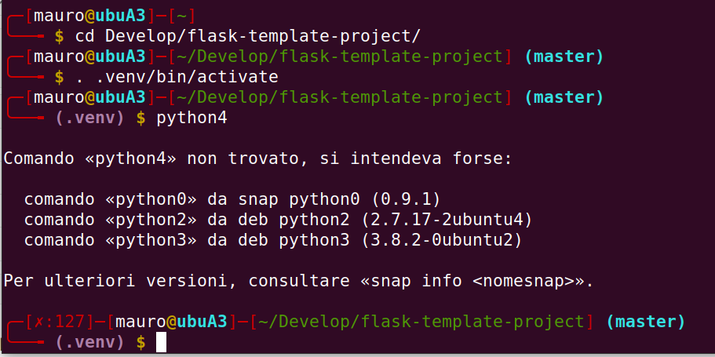

# Imposta il prompt della bash in modo simile a quello di Parrot OS

## aggiunge:

- visualizzazione del branch di git
- visualizzazione del venv di python se attivato
- visualizzazione del codice di errore

i file devono essere messi in `~/.bashrc.d/`

linea da inserire in `.bashrc`:

`[ -f ~/.bashrc.d/parrot-prompt.sh ] && source ~/.bashrc.d/parrot-prompt.sh && parrot_prompt $color_prompt`

esempio del risultato:
